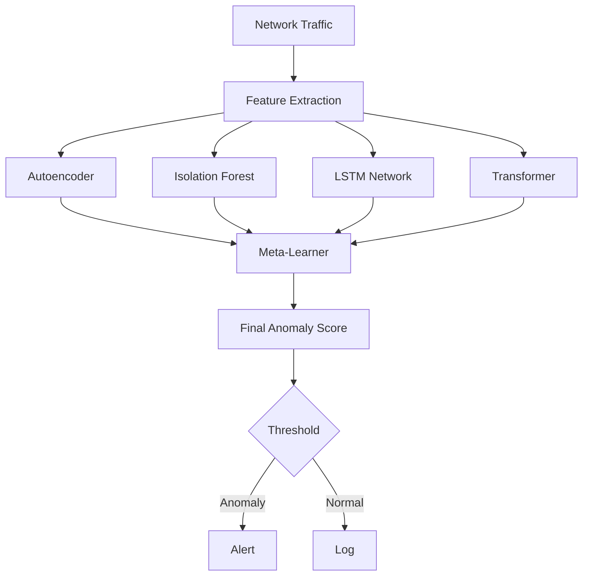
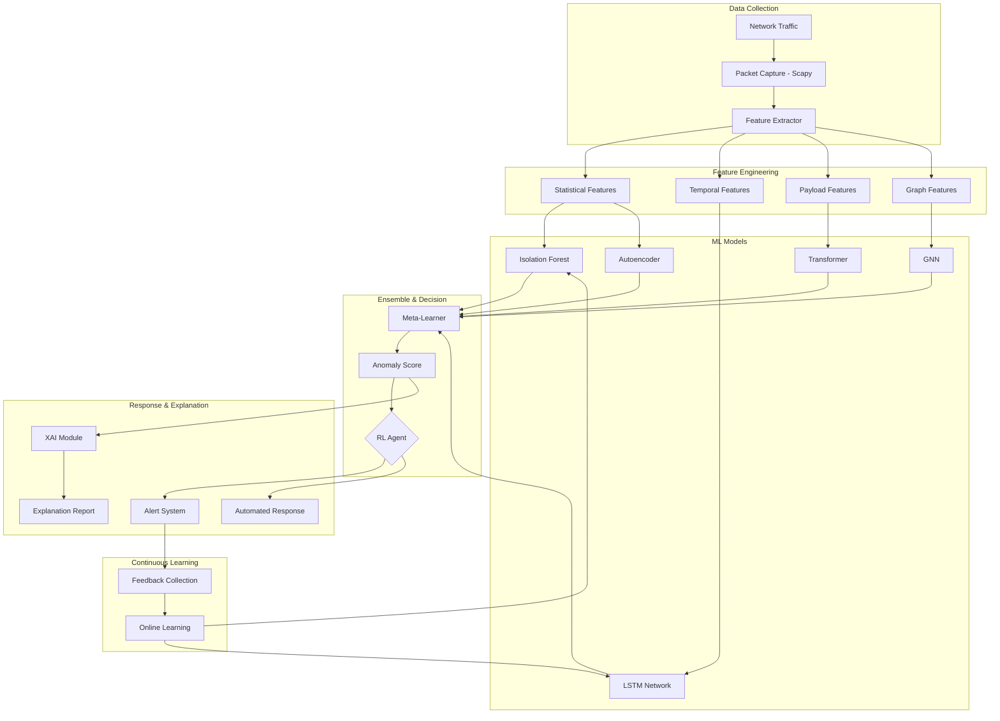

# AI/ML Enhancement Proposal for Cognitive Anomaly Detector

## Executive Summary

This proposal outlines a comprehensive strategy to enhance the current rule-based anomaly detection system with advanced AI/ML techniques. The current system relies on static thresholds, pattern matching, and simple statistical methods. By integrating modern machine learning approaches, we can significantly improve detection accuracy, reduce false positives, adapt to evolving threats, and detect novel attack patterns.

---

## Current System Analysis

### Existing Architecture

The current anomaly detector implements:

**Detection Mechanisms:**
- **Traffic Rate Analysis**: Monitors packet rates per IP using a simple threshold multiplier (2x average)
- **Pattern Matching**: Uses regex patterns to detect known malicious payloads (SQL injection, XSS, shell commands)
- **Port-Based Detection**: Flags traffic on uncommon ports
- **Protocol Analysis**: ICMP flood detection, large payload detection

**Technology Stack:**
- Python with Scapy for packet capture
- Statistics-based rate calculations
- Rule-based pattern matching

### Key Limitations

> [!WARNING]
> **Critical Limitations of Current System**

1. **No Adaptive Learning**: Static thresholds cannot adapt to network behavior changes
2. **High False Positive Rate**: Fixed multipliers don't account for legitimate traffic spikes
3. **Known Patterns Only**: Regex matching only detects documented attack signatures
4. **Zero-Day Vulnerability**: Cannot detect novel or polymorphic attacks
5. **No Contextual Awareness**: Treats all IPs and traffic patterns equally
6. **Limited Feature Extraction**: Uses only simple metrics (rate, size, port)
7. **No Sequential Pattern Recognition**: Cannot detect multi-stage attacks
8. **Static Configuration**: Requires manual tuning of thresholds

---

## Proposed AI/ML Enhancements

### 1. **Unsupervised Anomaly Detection with Autoencoders**

#### Overview
Deploy deep autoencoders to learn normal network behavior patterns and detect anomalies as reconstruction errors.

#### Technical Approach
```python
# Architecture
Input Layer → Encoder (Dense layers with dropout) → 
Latent Representation → Decoder → Reconstruction → 
Anomaly Score (MSE between input and reconstruction)
```

**Features to Extract:**
- Packet size distribution
- Inter-arrival times
- Protocol distribution
- Port usage patterns
- Payload entropy
- Connection duration

**Implementation Strategy:**
1. **Training Phase**: Learn normal traffic patterns from clean baseline data
2. **Detection Phase**: High reconstruction error indicates anomaly
3. **Threshold Adaptation**: Use percentile-based thresholds (e.g., 99th percentile)

#### Benefits
- Detects unknown threats without labeled data
- Adapts to network-specific patterns
- Lower false positives compared to static thresholds
- Can detect subtle deviations

#### Libraries
- TensorFlow/Keras or PyTorch for autoencoder
- Scikit-learn for preprocessing

---

### 2. **Isolation Forest for Outlier Detection**

#### Overview
Use tree-based isolation forests to identify anomalous network behaviors in high-dimensional feature space.

#### Technical Approach
```python
from sklearn.ensemble import IsolationForest

# Multi-dimensional features
features = [
    'packets_per_second',
    'bytes_per_packet',
    'unique_ports_contacted',
    'protocol_diversity',
    'payload_entropy',
    'tcp_flags_pattern',
    'inter_packet_variance'
]

model = IsolationForest(
    contamination=0.01,  # Expected anomaly rate
    n_estimators=100,
    random_state=42
)
```

#### Benefits
- Fast training and inference
- Handles high-dimensional data well
- Robust to irrelevant features
- No need for labeled anomaly data

#### Use Cases
- Real-time anomaly scoring
- Complementary to deep learning approaches
- Resource-efficient for embedded deployments

---

### 3. **LSTM Networks for Sequential Pattern Analysis**

#### Overview
Implement Long Short-Term Memory networks to capture temporal dependencies and detect multi-stage attacks.

#### Technical Approach
```python
# Architecture
Input: Sequence of network events over time window
LSTM Layer 1 (128 units) → Dropout (0.3) →
LSTM Layer 2 (64 units) → Dropout (0.3) →
Dense Layer → Binary Classification (Normal/Anomaly)
```

**Sequence Features:**
- Time-series of packet rates
- Protocol sequences
- Port scanning patterns
- Behavioral flow analysis

#### Benefits
- Detects time-dependent attack patterns (e.g., slow port scans)
- Recognizes attack stages (reconnaissance → exploitation)
- Captures periodicities and trends

#### Applications
- DDoS attack prediction
- APT (Advanced Persistent Threat) detection
- Botnet command-and-control detection

---

### 4. **Transformer-Based Payload Analysis**

#### Overview
Use pre-trained language models (BERT-style transformers) fine-tuned on network payloads for sophisticated malware detection.

#### Technical Approach

**Model Selection:**
- Start with DistilBERT or RoBERTa base
- Fine-tune on network payload corpora

**Tokenization:**
```python
# Convert binary payloads to hex representation
payload_hex = payload.hex()
# Or use byte-pair encoding (BPE)
tokens = tokenizer.encode(payload_hex)
```

**Detection Capabilities:**
- SQL injection variants
- Obfuscated JavaScript/XSS
- Encoded shell commands
- Polymorphic malware signatures

#### Benefits
- Context-aware pattern recognition
- Detects obfuscated attacks
- Transfer learning from general NLP models
- Handles variable-length payloads

---

### 5. **Ensemble Meta-Learning System**

#### Overview
Combine multiple models using meta-learning to achieve superior detection performance.

#### Architecture



**Meta-Learner Options:**
1. **Voting Ensemble**: Majority vote or weighted average
2. **Stacking**: Train a meta-classifier on model predictions
3. **Boosting**: AdaBoost or gradient boosting on weak learners

#### Benefits
- Reduces false positives through consensus
- Leverages strengths of multiple approaches
- More robust to adversarial attacks

---

### 6. **Online Learning with Incremental Updates**

#### Overview
Implement online learning algorithms that continuously adapt to new traffic patterns without full retraining.

#### Technical Approach

**Algorithms:**
- **Online SGD**: Update model weights incrementally
- **River Library**: Streaming machine learning
- **Incremental PCA**: Adaptive feature extraction

```python
from river import anomaly, preprocessing

# Online anomaly detection
scaler = preprocessing.StandardScaler()
detector = anomaly.HalfSpaceTrees(n_trees=25, height=15)

# Update model per packet
for packet_features in traffic_stream:
    scaled = scaler.learn_one(packet_features).transform_one(packet_features)
    score = detector.score_one(scaled)
    detector.learn_one(scaled)
```

#### Benefits
- Adapts to network changes in real-time
- No periodic retraining required
- Lower computational overhead
- Handles concept drift

---

### 7. **Graph Neural Networks for Network Topology Analysis**

#### Overview
Model network communications as graphs and use GNNs to detect anomalous interaction patterns.

#### Technical Approach

**Graph Representation:**
- **Nodes**: IP addresses, devices, services
- **Edges**: Communication flows
- **Node Features**: Traffic volume, protocol distribution
- **Edge Features**: Bandwidth, latency, packet loss

**GNN Architecture:**
```python
# Using PyTorch Geometric
GCNConv Layer 1 → ReLU → Dropout →
GCNConv Layer 2 → ReLU → Dropout →
Global Pooling → Dense → Anomaly Classification
```

#### Detection Targets
- Lateral movement in networks
- Command-and-control communications
- Unusual peer-to-peer patterns
- Network reconnaissance

#### Benefits
- Understands network topology context
- Detects distributed attacks
- Identifies compromised nodes

---

### 8. **Adversarial Training for Robustness**

#### Overview
Improve model robustness against evasion attacks using adversarial training techniques.

#### Technical Approach

**Training Process:**
1. Generate adversarial examples using FGSM, PGD
2. Train model on mix of clean and adversarial samples
3. Evaluate robustness metrics

```python
# Adversarial example generation
def fgsm_attack(model, data, epsilon=0.1):
    data.requires_grad = True
    output = model(data)
    loss = criterion(output, target)
    model.zero_grad()
    loss.backward()
    perturbed = data + epsilon * data.grad.sign()
    return perturbed
```

#### Benefits
- Resistant to adversarial evasion
- Maintains performance on perturbed inputs
- Critical for production security systems

---

### 9. **Explainable AI (XAI) Integration**

#### Overview
Implement interpretability techniques to understand and explain model decisions.

#### Techniques

**SHAP (SHapley Additive exPlanations):**
```python
import shap

explainer = shap.TreeExplainer(isolation_forest_model)
shap_values = explainer.shap_values(features)

# Visualize feature importance
shap.summary_plot(shap_values, features)
```

**LIME (Local Interpretable Model-agnostic Explanations):**
- Explain individual predictions
- Identify which features triggered alerts

**Attention Visualization:**
- For transformer/LSTM models
- Show which payload sections are suspicious

#### Benefits
- Security analysts understand WHY alerts triggered
- Builds trust in ML systems
- Facilitates debugging and refinement
- Meets compliance requirements

---

### 10. **Reinforcement Learning for Adaptive Response**

#### Overview
Use RL agents to learn optimal response strategies based on detection outcomes and feedback.

#### Technical Approach

**State Space:**
- Current network metrics
- Recent alert history
- System resource utilization

**Action Space:**
- Alert severity level
- Rate limiting action
- Block IP address
- Trigger deep inspection
- No action

**Reward Function:**
```python
reward = (
    +10 for true positive detection
    -5 for false positive
    -20 for missed attack (false negative)
    -1 for computational overhead
)
```

**Algorithm Options:**
- Deep Q-Network (DQN)
- Proximal Policy Optimization (PPO)
- Actor-Critic methods

#### Benefits
- Optimizes alert thresholds automatically
- Balances detection vs. false positives
- Learns from operational feedback
- Reduces analyst workload

---

## Implementation Roadmap

### Phase 1: Foundation (Months 1-2)

**Objectives:**
- [ ] Set up ML infrastructure (MLflow, TensorBoard)
- [ ] Create data pipeline for feature extraction
- [ ] Collect and label baseline traffic data
- [ ] Implement Isolation Forest as first ML model

**Deliverables:**
- Feature engineering pipeline
- Labeled dataset (10K+ samples)
- Working Isolation Forest prototype
- Performance benchmarks vs. current system

---

### Phase 2: Core Models (Months 3-5)

**Objectives:**
- [ ] Develop and train autoencoder for unsupervised detection
- [ ] Implement LSTM for sequential analysis
- [ ] Create ensemble meta-learner
- [ ] Establish model evaluation framework

**Deliverables:**
- Three trained ML models
- Model versioning and registry
- A/B testing framework
- Evaluation metrics dashboard

---

### Phase 3: Advanced Capabilities (Months 6-8)

**Objectives:**
- [ ] Integrate transformer-based payload analysis
- [ ] Develop GNN for topology analysis
- [ ] Implement adversarial training
- [ ] Deploy XAI tools

**Deliverables:**
- Advanced threat detection models
- Interpretability dashboards
- Robustness test results
- Documentation and user guides

---

### Phase 4: Production & Optimization (Months 9-12)

**Objectives:**
- [ ] Deploy online learning system
- [ ] Implement RL-based adaptive response
- [ ] Optimize inference latency
- [ ] Complete system integration

**Deliverables:**
- Production-ready ML pipeline
- Automated retraining workflows
- Performance optimization report
- Final system documentation

---

## Technical Architecture

### Proposed System Design



### Technology Stack

| Component | Technology | Purpose |
|-----------|-----------|---------|
| **Deep Learning** | PyTorch / TensorFlow | Autoencoder, LSTM, Transformers |
| **Classical ML** | Scikit-learn | Isolation Forest, preprocessing |
| **Online Learning** | River | Streaming ML algorithms |
| **Graph ML** | PyTorch Geometric | GNN for topology analysis |
| **NLP** | Hugging Face Transformers | Payload analysis |
| **Explainability** | SHAP, LIME | Model interpretation |
| **RL** | Stable-Baselines3 | Adaptive response |
| **MLOps** | MLflow, Weights & Biases | Experiment tracking |
| **Serving** | FastAPI, TorchServe | Model deployment |
| **Monitoring** | Prometheus, Grafana | Performance monitoring |

---

## Evaluation Metrics

### Detection Performance

| Metric | Target | Description |
|--------|--------|-------------|
| **Precision** | > 0.95 | Reduce false positives |
| **Recall** | > 0.90 | Minimize missed threats |
| **F1-Score** | > 0.92 | Balanced performance |
| **AUC-ROC** | > 0.95 | Overall discrimination |
| **False Positive Rate** | < 0.05 | Usability threshold |

### Operational Metrics

| Metric | Target | Description |
|--------|--------|-------------|
| **Inference Latency** | < 100ms | Real-time requirement |
| **Throughput** | > 10K packets/sec | Network capacity |
| **Model Update Time** | < 5 min | Retraining/adaptation |
| **Memory Footprint** | < 2GB | Resource efficiency |

---

## Risk Assessment & Mitigation

> [!CAUTION]
> **Implementation Risks**

### Technical Risks

| Risk | Impact | Probability | Mitigation |
|------|--------|-------------|------------|
| **Insufficient Training Data** | High | Medium | Synthetic data generation, data augmentation |
| **Model Overfitting** | High | Medium | Cross-validation, regularization, ensemble methods |
| **Concept Drift** | High | High | Online learning, monitoring, periodic retraining |
| **Adversarial Attacks** | Critical | Low | Adversarial training, ensemble diversity |
| **High Latency** | Medium | Medium | Model quantization, edge optimization |

### Operational Risks

| Risk | Impact | Probability | Mitigation |
|------|--------|-------------|------------|
| **Increased Complexity** | Medium | High | Comprehensive documentation, training |
| **Resource Requirements** | Medium | High | Phased rollout, cloud scaling |
| **Integration Issues** | Medium | Medium | Extensive testing, backward compatibility |

---

## Resource Requirements

### Computation

**Training:**
- GPU: NVIDIA RTX 3090 or equivalent (24GB VRAM) for transformer training
- CPU: 16+ cores for data preprocessing
- RAM: 64GB minimum
- Storage: 500GB SSD for datasets and models

**Inference:**
- CPU: 8+ cores
- RAM: 16GB
- Optional GPU for transformer inference

### Data

- **Baseline Traffic**: 1M+ packets of normal traffic
- **Attack Samples**: 100K+ labeled attack instances
- **Continuous Stream**: ~1GB/day for online learning

### Personnel

- **ML Engineer**: Model development and training (6-12 months)
- **Security Engineer**: Domain expertise, threat modeling (ongoing)
- **DevOps Engineer**: MLOps pipeline, deployment (3-6 months)
- **Data Engineer**: Feature engineering, data pipeline (3-6 months)

---

## Success Criteria

> [!IMPORTANT]
> **Key Success Indicators**

### Quantitative Criteria

1. **50% reduction in false positive rate** compared to current system
2. **25% improvement in true positive rate** (threat detection)
3. **Detection of at least 3 novel attack types** not in ruleset
4. **< 100ms average inference latency** at 10K packets/sec
5. **95%+ system uptime** with ML components

### Qualitative Criteria

1. **Security analyst feedback**: positive reception, reduced workload
2. **Explainability**: analysts can understand 90%+ of alerts
3. **Adaptability**: system automatically adjusts to network changes
4. **Maintainability**: models can be updated without full system downtime

---

## Cost-Benefit Analysis

### Estimated Costs

| Category | One-Time Cost | Annual Recurring |
|----------|---------------|------------------|
| **Hardware** | $10,000 | $2,000 |
| **Cloud Services** | - | $12,000 |
| **Personnel** | - | $150,000 |
| **Software Licenses** | $5,000 | $5,000 |
| **Training & Education** | $10,000 | $5,000 |
| **Total** | **$25,000** | **$174,000** |

### Expected Benefits

| Benefit | Annual Value | Calculation |
|---------|--------------|-------------|
| **Reduced False Positives** | $50,000 | 200 hours saved × $250/hr |
| **Earlier Threat Detection** | $100,000 | Prevented breaches (estimated) |
| **Automated Response** | $75,000 | 300 hours saved × $250/hr |
| **Reduced Downtime** | $50,000 | 2% uptime improvement |
| **Total** | **$275,000** | - |

**ROI**: ~58% in Year 1, increasing in subsequent years

---

## Next Steps

### Immediate Actions

1. **Approve Proposal**: Review and approve this enhancement plan
2. **Data Collection**: Begin collecting baseline traffic data
3. **Environment Setup**: Provision ML infrastructure (GPU server, MLflow)
4. **Team Assembly**: Recruit or assign ML and data engineering resources

### 30-Day Plan

1. **Week 1-2**: Set up data pipeline and feature extraction
2. **Week 3**: Implement Isolation Forest baseline
3. **Week 4**: Evaluate baseline model and collect feedback

### Decision Points

- **Go/No-Go after Phase 1**: Assess Isolation Forest performance
- **Model Selection after Phase 2**: Choose best-performing models for ensemble
- **Production Readiness after Phase 4**: Final evaluation before full deployment

---

## Conclusion

Integrating AI/ML techniques into the cognitive anomaly detector will transform it from a static, rule-based system into an adaptive, intelligent security platform. The proposed enhancements leverage state-of-the-art techniques including:

✅ **Unsupervised learning** for zero-day detection  
✅ **Deep learning** for complex pattern recognition  
✅ **Online learning** for continuous adaptation  
✅ **Ensemble methods** for robust detection  
✅ **Explainable AI** for analyst trust  
✅ **Reinforcement learning** for optimal response  

This comprehensive approach will significantly improve threat detection capabilities while reducing operational burden through automation and intelligent alerting.

---

## References & Further Reading

### Academic Papers
- "Deep Learning for Network Anomaly Detection" (IEEE, 2021)
- "A Survey of Network Anomaly Detection Techniques" (ACM Computing Surveys, 2020)
- "Adversarial Examples in Network Intrusion Detection" (USENIX Security, 2022)

### Industry Standards
- NIST Cybersecurity Framework
- MITRE ATT&CK Framework
- OWASP Top 10

### Tools & Libraries
- [Scikit-learn Documentation](https://scikit-learn.org/)
- [PyTorch Geometric](https://pytorch-geometric.readthedocs.io/)
- [River: Online Machine Learning](https://riverml.xyz/)
- [SHAP: Explainable AI](https://shap.readthedocs.io/)

---

*Document Version: 1.0*  
*Created: December 2025*  
*Author: AI/ML Enhancement Team*
